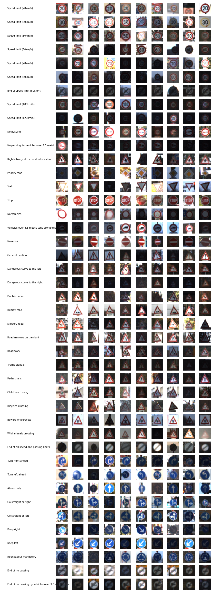
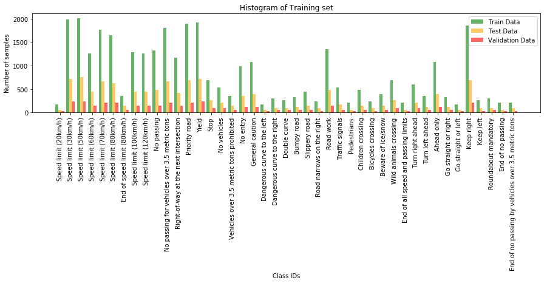
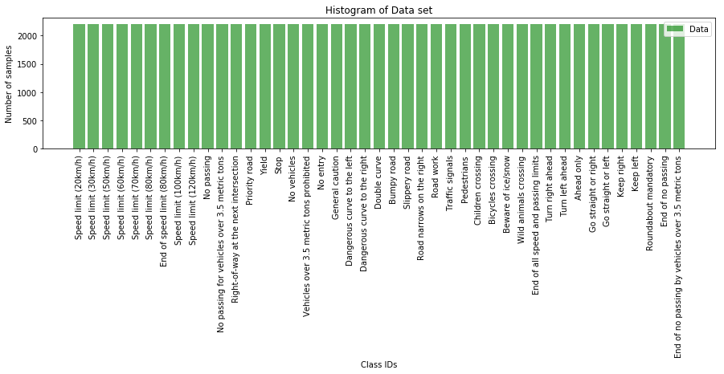
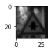
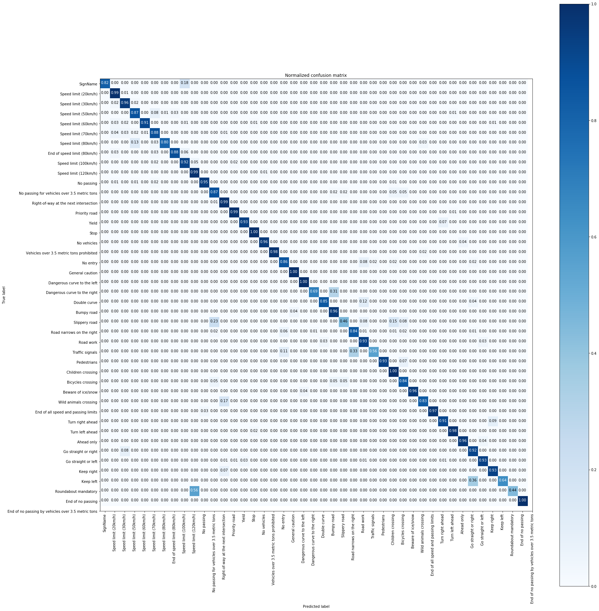
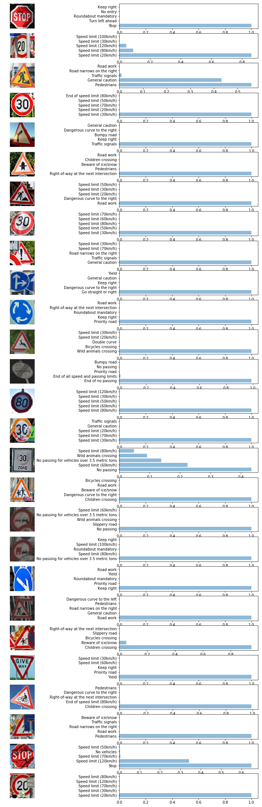
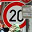
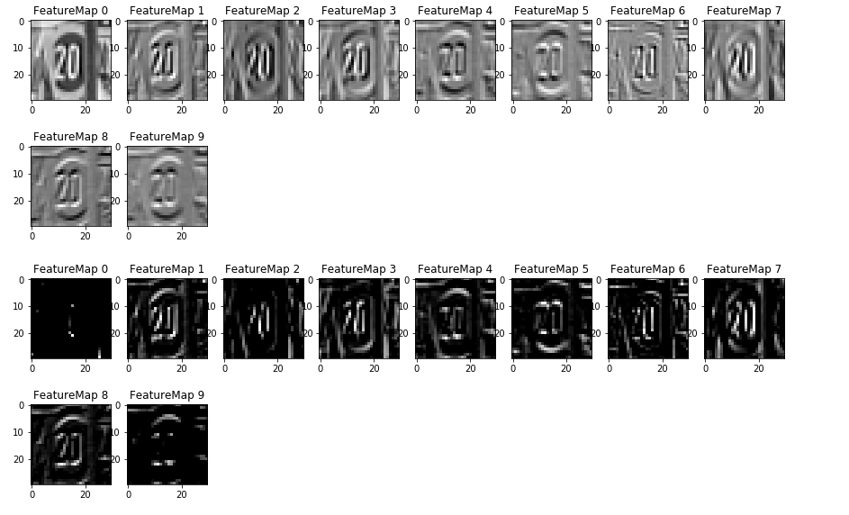

# **Traffic Sign Recognition: The Project**

Author : Manoj Kumar Subramanian


## Overview

This project is as part of my Submission to the Project 2: Traffic Sign Classifier Project for the Udacity Self Driving Car Nano Degree Program.

In this project, deep neural networks and convolutional neural networks are used to classify traffic signs. The model is trained and validated using the [German Traffic Sign Dataset](http://benchmark.ini.rub.de/?section=gtsrb&subsection=dataset) so it can classify traffic sign images. After the model is trained, the network is tried out on a set images of German traffic signs that is found on the web.

## The Project

The goals of this project are:

- To explore the dataset, provide summary and visualization of the data set
- Design, train and test a model architecture based on the Deep Learning and Convolutional Neural Network Architecture
- Test the model to make predictions on new images, Analyze the performance of the network on the new images
- Summarize the results with a written report

------


### 1. Data Set Summary & Exploration

The following code snipped loads the downloaded pickle files.

```python
def Load_Data_From_File(pickle_file):
    with open(pickle_file, mode='rb') as f:
        data = pickle.load(f)
    features, labels = np.array(data['features']), np.array(data['labels'])
    return features, labels

training_file = "train.p"
validation_file= "valid.p"
testing_file = "test.p"

X_train, y_train = Load_Data_From_File(training_file)
X_valid, y_valid = Load_Data_From_File(validation_file)
X_test, y_test = Load_Data_From_File(testing_file)
```

The dataset dimensions, size of the images and the number of unique classes were found using the numpy commands.

```python
print("Training Set shape:   X:{} , Y:{}".format(X_train.shape,y_train.shape))
print("Validation Set shape: X:{} , Y:{}".format(X_valid.shape,y_valid.shape))
print("Test Set shape:       X:{} , Y:{}".format(X_test.shape,y_test.shape))
###
###
print("Number of training examples =", n_train)
print("Number of validation examples =", n_validation)
print("Number of testing examples =", n_test)
print("Image data shape =", image_shape)
print("Number of classes =", n_classes)

```

Training Set shape:   X:(34799, 32, 32, 3) , Y:(34799,)

Validation Set shape: X:(4410, 32, 32, 3) , Y:(4410,)

Test Set shape:       X:(12630, 32, 32, 3) , Y:(12630,)

Number of training examples = 34799

Number of validation examples = 4410

Number of testing examples = 12630

Image data shape = (32, 32, 3)

Number of classes = 43

#### 2. Visualization of the dataset

The below snapshot provides a random list of images (10 numbers each) for the different classes mentioned as per the dataset.



This visualization provides us the following valuable information:

1. The Dataset contains the images having different type of light conditions and contrasts.
2. Also, there are a small variations in the scale of the required data between the images.


#### Histogram

In order to verify how many samples for each classes are available, the histogram is used to display.




It has to be noted that there is a huge difference between the number of samples among different classes of labels. This may lead the network to bias towards the larger sample classes. This was proved during the initial network modeling predictions after half a dozen of iterations and hence it called for adding additional dataset of images in order to make all the classes are having equal rights of samples.


So, added the additional dataset by augmenting the existing set of training dataset. The skimage library is used to perform random transformations on both Affine and Projective transforms which performed the following on the images: rescale, translate, rotate and shear operations. The exposure.adjust_gamma function is used to randomly create contrast differences among the images.

After additional dataset, the histogram looked like below (2200 images in each class):



### Design and Test a Model Architecture

#### 1. Pre-processing

1. The normalization technique mentioned in the lectures to have the grayscale calculations is used.

   (data - np.min(data))/(np.max(data)-np.min(data))

   | Before Normalizing                      | After Normalizing (Grayscale) |
   | --------------------------------------- | ----------------------------- |
   |  |    |

   ​

   ​

2. Modified norm image reduced the dimensions of the colour image from 3 to grayscale image of 1. Modified Norm Image data shape = (34799, 32, 32, 1)

3. The complete set of Augmented images training set was increased to the size : Total_X_train Shape =  (94600, 32, 32, 3) and its normalized set : (94600, 32, 32, 1)

   ​

#### 2. The Final NN Model

The final model consisted of the following layers:

|      Layer      |               Description                |
| :-------------: | :--------------------------------------: |
|      Input      |         32x32x1 grayscale image          |
| Convolution 3x3 | 1x1 stride, valid padding, outputs 30x30x10 |
|      RELU       |                                          |
|   Max pooling   |      2x2 stride,  outputs 15x15x10       |
| Convolution 4x4 | 1x1 stride, valid padding, outputs 12x12x20 |
|      RELU       |                                          |
|   Max Pooling   |       2x2 stride,  outputs 6x6x20        |
| Convolution 3x3 | 1x1 stride, valid padding, outputs 4x4x40 |
|      RELU       |                                          |
|   Max Pooling   |       2x2 stride,  outputs 2x2x40        |
| Fully Connected | Flattened to 160 features and reduced to 120 |
|      RELU       |                                          |
| Fully Connected |          Reduced from 120 to 84          |
|      RELU       |                                          |
|    Drop out     |           0.5 for training set           |
| Fully Connected |          Reduced from 84 to 43           |
|                 |                                          |


#### 3. Training Process

To start with, I have used the **LeNet architecture** described in the MNIST example in the lectures. With the EPOCH of 20 and without altering any other parameters, and with the provided training set without any augmentation the validation accuracy between 88.9% to 93.9% was achievable.

2017-10-20 18:18:02,483 - DEBUG - EPOCH 20 ...
2017-10-20 18:18:02,483 - DEBUG - Validation Accuracy = 0.889

2017-10-20 18:19:00,456 - DEBUG - Validation Accuracy = 0.939

But modifying the parameters of mu, sigma and the number of epochs didn't create much variations in the accuracy.

The difference between the validation accuracy and test accuracy (86%) were higher, so a **dropout** **layer** has been added to create redundant paths and to reduce overfit.

Then I used the **confusion matrix** to analyze on the pictures that are deviating on the predictions. It happened to be the images with lesser number of samples were predicted wrongly.



So the necessity to introduce additional data set with different augmentations triggered. Hence the **Augmented data set created** and the network was trailed with the Augmented Training dataset.

After training with the augmented dataset,

2017-11-02 17:43:16,280 - DEBUG - Validation Accuracy = 0.955

2017-11-02 17:43:20,558 - DEBUG - Test Accuracy = 0.930

the validation accuracy crossed 95.5% but the Test accuracy was in the borderline for passing the Project Rubrics of 93%. 

A closer look at the confusion matrix helped that, the images that are looking similar are getting confused among them. And the size of variation between the two are smaller compared to the filter size of 5x5 used in the LeNet.

The following code snippet parameters were tested for various cases like 

EPOCHs from 10, 15, 25, 35, 40, 50, 60 100, 

Batch sizes of 48, 64, 100, 128, 250, 500

sigma from 0.08, 0.1, 0.12, 0.15

learning rate as 0.0001, 0.0002, 0.0005, 0.0007, 0.0008, 0.001, 0.0015 and the following final results were arrived based on the output deviations.

```
EPOCHS = 50
BATCH_SIZE = 64
mu = 0
sigma = 0.1
rate = 0.001
```


I modified the **filter size to 3x3** in the first convolution layer, followed by a **4x4 filter and 3x3** so that small variation in the image between different classes shall also be captured during the convolution.

```python
Expanded the Lenet function so that the parameters are available globally for visualization purpose.

# SOLUTION: Layer 1: Convolutional. Input = 32x32x1. Output = 30x30x10.
conv1_W = tf.Variable(tf.truncated_normal(shape=(3, 3, 1, 10), mean = mu, stddev = sigma))
conv1_b = tf.Variable(tf.zeros(10))
conv1_c   = tf.nn.conv2d(x, conv1_W, strides=[1, 1, 1, 1], padding='VALID') + conv1_b

# SOLUTION: Activation.
conv1_r = tf.nn.relu(conv1_c)

# SOLUTION: Pooling. Input = 30x30x10. Output = 15x15x10.
conv1_p = tf.nn.max_pool(conv1_r, ksize=[1, 2, 2, 1], strides=[1, 2, 2, 1], padding='VALID')

#Added Dropout for 1st Layer
#conv1   = tf.nn.dropout(conv1, keep_prob/2)

# SOLUTION: Layer 2: Convolutional. Output = 12x12x20.
conv2_W = tf.Variable(tf.truncated_normal(shape=(4, 4, 10, 20), mean = mu, stddev = sigma))
conv2_b = tf.Variable(tf.zeros(20))
conv2_c   = tf.nn.conv2d(conv1_p, conv2_W, strides=[1, 1, 1, 1], padding='VALID') + conv2_b

# SOLUTION: Activation.
conv2_r = tf.nn.relu(conv2_c)

# SOLUTION: Pooling. Input = 12x12x20. Output = 6x6x20.
conv2_p = tf.nn.max_pool(conv2_r, ksize=[1, 2, 2, 1], strides=[1, 2, 2, 1], padding='VALID')


#Added Dropout for 2nd Layer
#conv2   = tf.nn.dropout(conv2, keep_prob/2)

# SOLUTION: Layer 3: Convolutional. Output = 4x4x40.
conv3_W = tf.Variable(tf.truncated_normal(shape=(3, 3, 20, 40), mean = mu, stddev = sigma))
conv3_b = tf.Variable(tf.zeros(40))
conv3_c   = tf.nn.conv2d(conv2_p, conv3_W, strides=[1, 1, 1, 1], padding='VALID') + conv3_b

# SOLUTION: Activation.
conv3_r = tf.nn.relu(conv3_c)

# SOLUTION: Pooling. Input = 4x4x40. Output = 2x2x40.
conv3_p = tf.nn.max_pool(conv3_r, ksize=[1, 2, 2, 1], strides=[1, 2, 2, 1], padding='VALID')


# SOLUTION: Flatten. Input = 2x2x40. Output = 160.
fc0   = flatten(conv3_p)


# SOLUTION: Layer 3a: Fully Connected. Input = 160. Output = 120.
fc1_W = tf.Variable(tf.truncated_normal(shape=(160, 120), mean = mu, stddev = sigma))
fc1_b = tf.Variable(tf.zeros(120))
fc11   = tf.matmul(fc0, fc1_W) + fc1_b

# SOLUTION: Activation.
fc11    = tf.nn.relu(fc11)


# SOLUTION: Layer 4: Fully Connected. Input = 120. Output = 84.
fc2_W  = tf.Variable(tf.truncated_normal(shape=(120, 84), mean = mu, stddev = sigma))
fc2_b  = tf.Variable(tf.zeros(84))
fc2    = tf.matmul(fc11, fc2_W) + fc2_b

# SOLUTION: Activation.
fc2    = tf.nn.relu(fc2)

# Added drop out at Fully connected layer 2
fc2_d   = tf.nn.dropout(fc2, keep_prob)

# SOLUTION: Layer 5: Fully Connected. Input = 84. Output = 43.
fc3_W  = tf.Variable(tf.truncated_normal(shape=(84, 43), mean = mu, stddev = sigma))
fc3_b  = tf.Variable(tf.zeros(43))
#logits = tf.matmul(fc2, fc3_W) + fc3_b
logits = tf.matmul(fc2_d, fc3_W) + fc3_b

```


Valid Accuracy = 0.964

**<u>Test Accuracy = 0.945</u>**

Train Accuracy = 0.999


This finalized architecture then brought in an accuracy of 94.5% on the test set.

I didn't play much around the optimizer settings as I have used the Adam optimizer from the LeNet example, but this shall be one task which I can take up as to understand between the properties of different optimizers.


#### 4. Test a Model on New Images

I have collected a random list of images from the internet, cropped, rescaled them to the required 32x32x3 dimensions, normalized the images to grayscale and sent through the network for predictions. The output is quite remarkable on few cases which I shall discuss below.




A comparison between actual and predicted is listed below

Accuracy 	: 77.77%


Here are the results of the prediction:


A closer look at where the predictions went wrong:

| Image                                    | Actual                       | Prediction                               | Comments on the Performance              |
| ---------------------------------------- | ---------------------------- | ---------------------------------------- | ---------------------------------------- |
|  | Dangerous Curve to the right | Traffic Signals                          | This is one place where the network predicted wrongly with very high confidence on the wrong signal. The sample image is slightly projected and the reflection on the image would have created a difference in predicting. |
|  | Road Work                    | Pedestrians (0.55), General Caution (0.41) | This image is different from the German dataset as the Road work image is in yellow color compared to white in the dataset. But making grayscale shouldn't have considered this, as in my previous trials, the network detected this as Road Work correctly. But it seemed, the prediction is not biased here as it got confused between Pedestrians and General Caution where both look similar. |
|  | Bicycle crossing             | Children Crossing                        | This image is also different from the German dataset as in German data set, there will not be a rider on the Bicycle crossing image. Hence the network was tuned to that and considered as the adult appeared in the image, it considered the bicycle as child and hence predicted the Children crossing |
|  | Roundabout Mandatory         | Priority Road                            | This is the drawback of using grayscales. My assumption is because of the augmented images having rotated edges for Priority road the network would have miscalculated this sheared version of Roundabout mandatory symbol. Had the network been trained with the colored samples, then the difference between the Yellow colored Priority Road and Blue colored Roundabout Mandatory would have classified them appropriately |


A set where the network performed better:

| Image                                    |        Actual        |      Prediction      | Comments on Performance                  |
| ---------------------------------------- | :------------------: | :------------------: | ---------------------------------------- |
|  | Speed limit (20km/h) | Speed limit (20km/h) | This image is a distorted image with noises in the bottom and about a few pixels on the right were blocked by another object. |
|  |     Pedestrians      |     Pedestrians      | This is a very tricky picture with almost 40% of the image blocked. Though the networked predicted correctly with almost full confidence |
|  |  Children Crossing   |  Children Crossing   | Here also, in spite of the blocked image, the network predicted correctly with major confidence |
| {:height="60px" width="60px"} |       30 km/h        |       30 km/h        | The noisy stickered image didn't bother the network as network had full confidence on predicting the image correctly. |


### Visualizing the Neural Network

A visual model on the layer level activations for the first 3 convolution layers are presented below. It can be noted that based on the shift in the gradients, the filter is looking for a specific pattern in that direction.




## References

<http://scikit-image.org/docs/dev/auto_examples/xx_applications/plot_geometric.html>

<http://www.scipy-lectures.org/packages/scikit-image/auto_examples/plot_features.html>

<http://scikit-image.org/docs/0.11.x/api/skimage.transform.html#skimage.transform.AffineTransform>

<https://github.com/aleju/imgaug>

 <https://www.researchgate.net/publication/281118372_NumPy_SciPy_Recipes_for_Image_Processing_Intensity_Normalization_and_Histogram_Equalization>

<http://opencvpython.blogspot.in/2013/03/histograms-2-histogram-equalization.html>

<https://medium.com/@awjuliani/visualizing-neural-network-layer-activation-tensorflow-tutorial-d45f8bf7bbc4>

<https://arxiv.org/pdf/1506.06579.pdf>

http://spatial-analyst.net/ILWIS/htm/ilwismen/confusion_matrix.htm